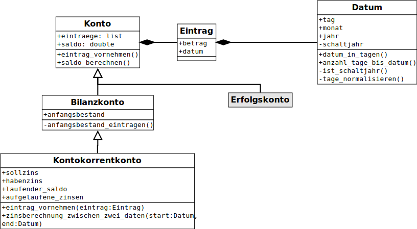
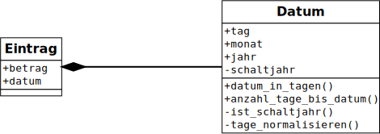
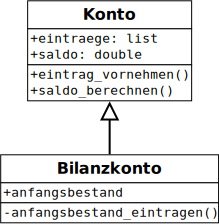

# Eine Einführung in die objektorientierte Programmierung

Die objektorientierte Programmierung (OOP) wird anhand der Modellierung
eines Kontokorrentkontos erläutert. Um ein Kontokorrentkonto zu
modellieren, wird es zuerst in seinem Kontext schematisch dargestellt.
Dazu wird ein
[UML-Klassendiagramm](https://de.wikipedia.org/wiki/Klassendiagramm)
erstellt.

## Das Klassendiagramm

Die folgende Abbildung zeigt ein Kontokorrentkonto in einem
UML-Klassendiagramm.

Dabei gelten zwischen den Klassen folgende Beziehungen:

- *Komposition*
  
  

  Hierbei handelt es sich um eine Beziehung als einem Ganzen und seinen
  Teilen. Im konkreten Beispiel besteht ein Eintrag aus einem Betrag und
  einem **Datum**. Das Datum ist dabei eine eigene Klasse. Die Klasse
  **Datum** ist also ein Teil der Klasse **Eintrag**.

  Dargestellt wird diese Beziehung durch eine Linie mit einem
  ausgefüllten rautenförmigen Kopf auf der Seite mit dem Ganzen.

  

- *Vererbung*
  
  

  Bei der Vererbung geht es um eine *ist ein* Beziehung. Im aktuellen
  Beispiel *ist* ein Bilanzkonto *ein* Konto. Für die Programmierung
  bedeutet das, dass die Klasse *Bilanzkonto* alle Eigenschafen der
  Klasse *Konto* aufweist. Diese werden in der Klasse *Bilanzkonto* um
  weitere Eigenschaften ergänzt und/oder an die Besonderheiten der
  Klasse *Bilanzkonto* angepasst. Im Beispiel erhält die Klasse
  *Bilanzkonto* zusätzlich zu den Attributen und Methoden der Klasse
  *Konto* das Attribut `anfangsbestand` sowie die Methode
  `anfangsbestand_eintragen()`.

  Dargestellt wird die Vererbung durch einen Pfeil, dessen Spitze auf
  die Oberklasse zeigt.

  

## Umsetzung in Python

Am einfachsten wird für jede Klasse ein eigenes File angelegt. Files mit
Python Quellcode haben die Endung `.py`. Der Name des Files kann frei
gewählt werden. Sinnvollerweise wählt man allerdings einen Namen, der
auf die Klasse Bezug nimmt. Für das Beispiel der Klasse *Datum* kann
dies dann beispielsweise `datum.py` sein.

Für das Beispiel des Kontokorrentkontos wird davon ausgegangen, dass
alle Klassen in einem eigenen File programmiert sind und dass alle Files
im gleichen Ordner liegen.

- *Umsetzung der Komposition in Python*
  
  Wie Kompositionen in Python realisiert werden, wird am Beispiel
  der Beziehung der Klassen *Datum* und *Eintrag* gezeigt.

  Die Klasse *Eintrag* hat die Attribute `betrag` und `datum`. Das
  Attribut `betrag` ist vom Typ `double` und kann ohne weiteres
  verwendet werden. Das Attribut `datum` ist vom Typ `Datum`. Diesen
  Datentypen haben wir in der Klasse *Datum* selber programmiert. Damit
  dieser verwendet werden kann, muss er in der Klasse *Eintrag*
  verfügbar gemacht werden.

  Dies geschieht mit dem *import statement* `from datum import Datum`.
  Damit steht in der Klasse *Eintrag* die Klasse *Datum* zur Verfügung.

- *Umsetzung der Vererbung in Python*
  
  Wie die Vererbung in Python umgesetzt wird, wird am Beispiel der
  Beziehung der Klassen *Konto* und *Bilanzkonto* gezeigt.

  Auch hier gilt, dass die durch die Klasse *Bilanzkonto* verwendeten
  selber geschriebenen Klassen mit den entsprechenden *import
  statements* verfügbar gemacht werden müssen. Die eigentliche
  Vererbung, das heisst die Übernahme der Attribute und Methoden der
  Oberklasse erfolgt in der Klassendefinition und sieht folgendermassen
  aus: `class Klassenname(NameDerOberklasse):`. Ausserdem werden im
  Konstruktor mit der Zeile `super().__init__(Attribute der Oberklasse)`
  die übernommenen Eigenschaften der Oberklasse initialisiert.

Zur Illustration dieser Erklärungen finden Sie den Quellcode für das
Kontokorrentkonto 
[hier](https://github.com/I-gW-23-27/Skript/tree/main/beispiele/Kontokorrentkonto)
abgelegt.
