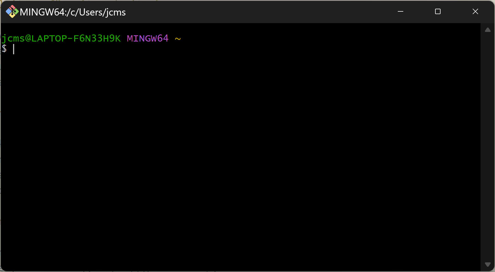

# Anleitung für Git und GitHub

Die folgenden Anleitungen basieren auf dem frei verfügbaren E-Book 
[Pro Git](https://git-scm.com/book/de/v2)
von Chacon und Straub.

Die Verwendung von Git und GitHub erfordern ein paar Vorbereitungen.
Die erforderliche Software muss installiert werden und ein Account für
GitHub muss angelegt werden. Optional, aber empfehlenswert ist die
Installation von Visual Studio Code als Texteditor.

## Installation von Git auf dem Rechner

Git kan unter [https://git-scm.com/](https://git-scm.com/)
heruntergeladen werden. Das .exe-File wird anschliessend per Doppelklick
installiert. Sobald der Installationsprozess abgeschlossen ist, kann git
auf dem Rechner verwendet werden.

## Erstellen eines Kontos auf GitHub

Als nächster Schritt ist ein Konto auf GitHub zu erstellen. Dazu ist die
Seite [GitHub.com](https://github.com/) aufzurufen und oben rechts auf
der Seite **Sign up** anzuklicken. Nehmen Sie für Ihren Account die
KBW-Mail-Adresse.

Damit das GitHub Konto vom eigenen Computer aus erreicht werden kann,
müssen die Zugangsdaten noch hinterlegt werden. Dies wird von einem
Terminal aus erledigt. Um ein Terminalfenster zu öffnen, sucht man im
Start-Menü nach *Git Bash*. Wenn man *Git Bash* öffnet, öffnet sich ein
schwarzes Fenster mit zwei Zeilen Text.



In diesem Fenster gibt man nach dem Dollar-Zeichen die folgenden zeilen
ein.

`git config --global user.name "John Doe"`

und

`git config --global user.email johndoe@example.com`

Beide Zeilen sind mit Enter abgeschlossen.

## Installation von Visual Studio Code

Visual Studio Code (oder VS Code) kann von der Seite
[https://code.visualstudio.com/download](https://code.visualstudio.com/download)
heruntergeladen werden. Für die Redaktion Deutscher Texte lohnt sich die
Installation der Erweiterung *German Language Pack for Visual Studio
Code*. Ausserdem lohnt sich für die bessere Vergleichbarkeit von
Textversionen die Installation der Erweiterung *Rewrap*. Diese sorgt
dafür, dass es keine überlagnen Zeilen gibt.

## Ein Demonstrationsprojekt starten

Loggen Sie sich auf GitHub ein. Oben rechts gibt es einen grünen Knopf
mit einem Buchsymbol und dem Text *New*. Klicken Sie den Knopf an. Im
Feld *Repository name* wählen Sie einen Namen für Ihr Projekt. Setzen
Sie das Repository auf *Private* (gekennzeichnet mit einem
Schloss-Symbol). Als leztes wählen Sie noch die Option *Add a README
file* aus. Die Einrichtung wird abgeschlossen mit dem grünen Knopf
*Create repository*.

Nach diesem Schritt steht das Repository auf GitHub (online) zur
Verfügung. Um das Projekt auf dem eigenen Rechner weiter bearbeiten zu
können, wechseln Sie im Windows Explorer in den Ordner, in dem Sie Ihr
Projekt abspeichern wollen. Öffnen Sie in diesem Ordner ein Terminal.
Das machen Sie, indem Sie die Taste `Ctrl` und L gleichzeitig drücken.
Dadurch wird der Text in der Adresszeile ausgewählt. Überschreiben Sie
den ausgewählten Text mit `cmd`. Schliessen Sie diese Eingabe mit der
Enter-Taste ab. Darauf öffnet sich ein Terminal-Fenster.

Wechseln Sie zum GitHub Fenster mit dem Repository. Klicken Sie dort auf
den grünen Knopf *Code*. Im sich öffnenden Menü kopieren Sie die URL
(*https://github.com/user/repo...*). Mit der Adresse im Zwischenspeicher
wechseln Sie ins Terminal-Fenster.

Im Terminal geben Sie den Befehl `git clone
https://github.com/user/repo...` ein. Damit wird ein neuer Ordner mit
dem von Ihnen gewählten Namen des Projektes angelegt.

## Im Demonstrationsprojekt arbeiten

Im Ordner mit dem Namen des Projektes findet sich Ordner *.git* und ein
File *README.md*. Am einfachsten ist das Projekt mit Visual Studio Code
zu bearbeiten.

Um das Projekt in Visual Stuido Code zu öffnen, muss man mit Rechtsklick
auf den Ordner das Kontextmenü öffnen. Dort kann dann ausgewählt werden
*mit Visual Studio Code öffnen*.

Um die Möglichkeiten von Git auszuprobieren, kann das File *README.md*
geöffnet werden. Der Text kann nun bearbeitet werden. Wenn ein Abschnitt
verfasst worden ist, kann er mit einem sogenannten Commit als
Wiederherstellungspunkt definiert werden. Es gibt verschiedene
Möglichkeiten, einen solchen Commit zu erstellen. Die allgemeinste
Variante erfolgt in der *Git Bash*. Dazu muss noch einmal das
Kontextmenü für den Ordner des Projekts aufgeraufen werden. Diesmal ist
*Git Bash hier öffnen* auszuwählen. Um den Commit zu erstellen, ist in
der *Git Bash* der Befehl `git add README.md` einzugeben. Damit wird das
File *README.md* "gestaged". Das heisst, das File wird für den Commit
ausgewählt. Der eigentliche Commit wird mit dem Befehl `git commit`
initiert. Auf diesen Befehl öffnet sich ein Editorfenster. Dort kann
eine kurze Beschreibung der gespeicherten Änderung verfasst werden.
Diese Beschreibung ist die *Commit Message*.

Alle gemachten *Commits* können in *Git Bash* mit dem Befehl `git log`
aufgerufen werden. Alle *Commits* sehen gleich aus:

```
commit 28410ed1118189fbf284bbc087003780409aca55
Author: Jacques Mock Schindler <jacques.mock@kbw.ch>
Date:   Fri Jan 19 20:16:30 2024 +0100

    Was ist ein Commit
```

Nach dem Schlüsselwort *commit* folgt eine Hexadezimalzahl die einen
"Fingerabdruck" für den *Commit* darstellt. Die beiden Schlüsslworte
*Author* und *Date* sind selbsterklärend. Etwas eingerückt folgt dann
die Commit Nachricht.

Weitere Erklärungen folgen in einer Woche.