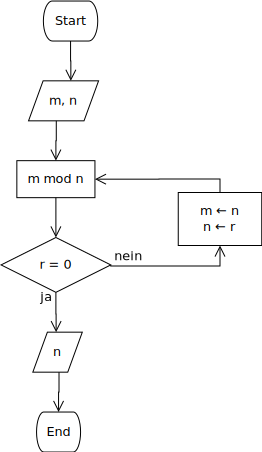

# Algorithmen

Der Begriff *Algorithmus* ist aktuell omnipräsent. Oft hat der Begriff
allerdings einen negativen Unterton. Aber was ist ein *Algorithmus*?

Die 
[Wikipedia definiert den Begriff](https://de.wikipedia.org/wiki/Algorithmus) 
folgendermassen:

>Ein Algorithmus [...] ist eine eindeutige Handlungsvorschrift zur Lösung
>eines Problems oder einer Klasse von Problemen. Algorithmen bestehen aus
>endlich vielen, wohldefinierten Einzelschritten. 

Donald E. Knuth beschreibt im ersten Band seines Fundamentalen sieben
Bände umfassenden Werkes *"The Art of Computer Programming"* die
Herkunft des Begriffes. Es handelt sich um die mit der Zeit entstellte
Form des letzten Teils des Namens von *Abu 'Abd Allah Muhammad ibn Musa
al-Khwarizmi*[^1].

Salopp umformuliert ist ein Algorithmus ein Rezept zum Lösen konkreter
Probleme. 

## Algorithmen in der Informatik

Wie Alogrithmen in der Informatik verwendet werden, soll am Beispiel der
Berechnung des grössten gemeinsamen Teilers nach der Beschreibung von
Euklid ([Euklidischer
Algorithmus](https://de.wikipedia.org/wiki/Euklidischer_Algorithmus))
gezeigt werden.

**Algorithmus E** (Euklidischer Algorithmus). Gegeben seien zwei
positive natürliche Zahlen $m$ und $n$. Gesucht ist deren grösster
gemeinsamer Teiler.

**E1.** \[Rest berechnen.\] Teile $m$ durch $n$. Der Rest sei $r$. (Es
gilt $0 \leq r < n$.)  

**E2.** \[Ist der Rest null?\] Wenn $r = 0$ endet der Algorithmus und
$n$ ist die Lösung.

**E3.** \[Reduzieren.\] Setze $m \leftarrow n, n \leftarrow r$ und gehe
zurück zu Schritt E1.[^2]

Der Algorithmus E kann in das folgende Flussdiagramm übersetzt werden.



Die graphische Darstellung von Algorithmus E als Flussdiagramm hilft,
eine entsprechende Funktion in Python zu implementieren.

```Python
def euclid(m : int, n : int) -> int:
    r = m % n
    while r > 0:
        m = n
        n = r
        r = m % n
    return n
```

## Aufgabe

Berechnen Sie von Hand nach dem Euklidischen Algorithmus den grössten
gemeinsamen Teiler für die Zahlen 544 und 119.  Erstellen Sie eine
Tabelle in welcher Schlaufe für Schlaufe die Werte für die Variablen $m$
und $n$ eingetragen sind.


Eine Übung in Python findet sich in diesem Jupyter Notebook.


[^1]: Knuth, Donald Ervin; The Art of Computer Programming (Fundamental
    Algorithms); 3rd ed.; Bd. I.; Reading, Mass: Addison-Wesley, 1997;
    Seite. 1.
    
[^2]: Knuth, aaO., Seite 2 f.
