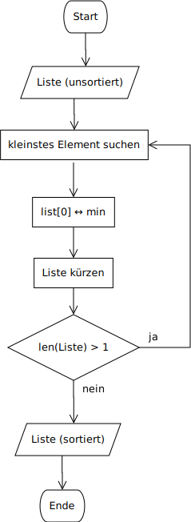

# Sortieren

In diesem Notebook geht es um ein Thema, das im Zusammenhang mit
Computerprogrammen häufig anzutreffen ist: Das sortieren von Elementen
in auf- oder absteigender Reihenfolge. Um sich die Bedeutung sortierter
Elemente vor Augen zu führen, stellen Sie sich ein Wörterbuch vor, in
dem die Wörter nicht alphabetisch sortiert sind.

## Selection Sort

Einer der einfachsten Sortieralgorithmen fundktioniert folgendermassen:
Als erstes wird das kleinste Element in der zu sortierenden Liste
gesucht. Wenn das kleinste Element gefunden wurde, tauscht es den Platz
mit dem Element zuvorderst in der Liste. Als nächstes wird das
zweitkleinste Element gesucht. Dieses tauscht den Platz mit dem zweiten
Element der Liste. Dies wird fortgesetzt, bis das grösste Element auf
dem letzten Platz der Liste sitzt.

### Aufgabe

Beschreiben Sie den Algorithmus von Selection Sort analog zur
Darstellung auf der Theorieseite.

### Musterlösung

**Algorithmus S** (Selection Sort). Gegeben sei eine Liste mit
sortierbaren Elementen. Gesucht ist die Liste mit den aufsteigend
sortierten Elementen.

**S1.** \[Kleinstes Element.\] Suche das kleinste Element in der Liste.  
**S2.** \[Tausche Platz.\] Das kleinste Element tauscht den Platz mit
dem Element zuvorderst in der Liste.  
**S3.** \[Liste kürzen.\] Das vorderste Element der Liste wird von der
Weiterverarbeitung ausgenommen. Wenn die gekürzte Liste eine Länge von 1
aufweist, ist die Liste sortiert. Andernfalls weiter mit Schritt S1. 

### Aufgabe

Zeichnen Sie ein Flussdiagramm des formalisierten Selection Sort Algorithmus.



### Aufgabe

Implementieren Sie Selection Sort in Python.


```python
def selection_sort(arr):
    # Durchlaufen des Arrays
    for i in range(len(arr)):
        # Finde das kleinste Element im verbleibenden unsortierten Array
        min_idx = i
        for j in range(i+1, len(arr)):
            if arr[j] < arr[min_idx]:
                min_idx = j
        
        # Tausche das gefundene kleinste Element mit dem ersten Element
        arr[i], arr[min_idx] = arr[min_idx], arr[i]
    
    return arr
```


```python
chaos = [7,3,2,5,1,8,9]
print(selection_sort(chaos))
```

    [1, 2, 3, 5, 7, 8, 9]
    


```python
print(selection_sort(chaos))
```

    [1, 2, 3, 5, 7, 8, 9]
    
