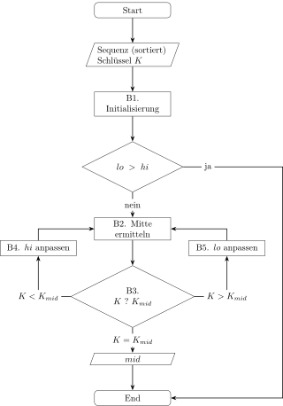
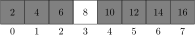
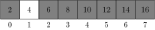
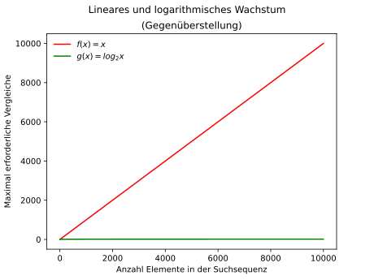

# Suchen

Ein bestimmtes Datum in einer Datensammlung zu suchen, ist eine immer
wieder vorkommende Aufgabe in der Informatik. Es gibt daher auch eine
Vielzahl an Suchalgorithmen.
Damit diese Suchalgorithmen funktionieren, werden die Daten mit einem
Schlüssel versehen und als Schlüssel-Werte-Paar abgespeichert. Der
Datentyp des Schlüssels wird dabei so gewählt, dass er einfach zu
sortieren ist. Der abgespeicherte Wert dagegen kann von einem beliebigen
Datentypen sein.  
Für die Beschreibung der Suchalgorithmen wird nur auf die Schlüssel
abgestellt. Um die Darstellung zu vereinfachen, wird auf eine
Berücksichtigung der abgespeicherten Werte verzichtet.  
In der Folge werden zwei Suchalgorithmen vorgestellt.
 
## Lineare Suche

Mit der linearen Suche wird über eine Sequenz von Daten iteriert, bis
das gesuchte Element gefunden wird oder das Ende der Sequenz erreicht
ist. Die lineare Suche ist in Python sehr einfach zu realisieren:

```Python
def linear_search(seq, x):
    """
    Durchsucht sequenziell eine gegebene Sequenz und gibt den Index
    des gesuchten Wertes zurück.

    Parameter:
    seq (list): Die Sequenz, in der gesucht wird.
    x: Der Wert, nach dem in der Sequenz gesucht wird.

    Rückgabewert:
    int: Der Index des gesuchten Wertes in der Sequenz. Gibt -1 
    zurück, wenn der Wert nicht in der Liste gefunden wird.

    Beispiel:
    >>> linear_search([1, 2, 3, 4], 3)
    2
    >>> linear_search(['a', 'b', 'c'], 'd')
    -1
    """
    index = 0
    for datum in seq:
        if datum = x:
            return index
        index += 1
    return -1
```

Die lineare Suche ist sehr einfach. Ausserdem funktioniert sie
unabhängig davon, ob die zu durchsuchende Sequenz geordnet ist.
Allerdings wächst der Suchaufwand
proportional zur Länge der zu durchsuchenden Sequenz. Daher wird als
nächstes die binäre Suche vorgestellt. Hier steigt der Aufwand mit
zunehmender Länge der zu durchsuchenden Sequenz deutlich weniger
schnell. 

## Binäre Suche

Grundlage für die binäre Suche ist eine Sequenz sortierter Daten.

Eine sortierte Sequenz kann durchsucht werden, in dem als erstes der
mittlere Wert der Sequenz mit dem gesuchten Wert verglichen wird. Ist
der gesuchte Wert kleiner als dieser mittlere Wert, dann ist die Suche
in der linken Hälfte der Sequenz fortzusetzen, ist der Wert grösser, in
der rechten. In der entsprechenden Hälfte wird wieder der
mittlere Wert mit dem gesuchten Wert verglichen und dann entweder links
oder rechts von diesem Wert weiter gesucht. Dieses vorgehen wird so
lange fortgesetzt, bis entweder der gesuchte Wert gefunden wird oder
kein Wert zum vergleichen mehr übrig ist.

### Formale Beschreibung

Formal wurde der Algorithmus der binären Suche von Donald E. Knuth
folgendermassen beschrieben[^1]:

**Algorithmus B** (*Binäre Suche*). Gegeben eine Sequenz von
Daten $D_1, D_2, ..., D_N$ mit Schlüsseln in aufsteigender Reihenfolge
$K_1 < K_2 < \cdots < K_N$, sucht der Algorithmus nach einem Schlüssel
$K$. 

**B1.** [Initialisierung.] Setze $lo \leftarrow 0$, $hi \leftarrow N-1$.

**B2.** [Mitte ermitteln.] Falls $lo > hi$ endet der Algorithmus ohne
Treffer. Andernfalls entspricht die ungefähre Mitte $mid \leftarrow
\lfloor(lo + hi)/2\rfloor$.

**B3.** [Vergleiche.] Falls $K < K_{mid}$ gehe zu B4; falls $K> K_{mid}$
gehe zu B5. Falls $K=K_{mid}$ endet der Algorithmus erfolgreich.

**B4.** [Passe $hi$ an.] Setze $hi \leftarrow mid - 1$ und gehe zu B2.

**B5.** [Passe $lo$ an.] Setze $lo \leftarrow mid + 1$ und gehe zu B2.

### Flussdiagramm des Algorithmus



### Iterative Implementierung in Python

```Python
def binary_search(seq, x):
    """
    Führt eine binäre Suche in einer sortierten Sequenz durch und 
    gibt den Index des gesuchten Wertes zurück. 

    Parameter:
    seq (list): Die sortierte Sequenz, in dem die Suche durchgeführt 
    wird.
    x: Der zu suchende Wert.

    Rückgabewert:
    int: Der Index des gesuchten Wertes in `seq`. Gibt -1 zurück, 
    wenn der Wert nicht in der Sequenz gefunden wird.

    Anmerkungen:
    - Die Funktion erwartet, dass `seq` bereits sortiert ist.
    - Die Suche ist effizient, da sie die Liste in jeder Iteration 
      halbiert.
    - Falls `x` mehrfach in `seq` vorkommt, wird der Index einer 
      der Instanzen von `x` zurückgegeben.

    Beispiel:
    >>> binary_search([1, 2, 3, 4, 5], 3)
    2
    >>> binary_search([1, 2, 4, 5], 3)
    -1
    """
    index = -1
    lo = 0
    hi = len(seq) - 1

    while lo < hi:
        middle = (lo + hi) // 2
        if x == seq[middle]:
            return middle
        elif x < seq[middle]:
            hi = (lo + middle) // 2
        else:
            lo = (middle + hi) // 2 + 1

    return index

```

Im folgenden wird Schritt für Schritt gezeigt, was geschieht, wenn der
Funktion `binary_search()` die Sequenz 2, 4, 6, 8, 10, 12, 14, 16 und
der gesuchte Wert 7 übergeben wird.

Als erstes wird der Index des Wertes in der Mitte der Sequenz berechnet
und `middle` zugewiesen.
$$(0+7)\ mod\ 2 = 3$$



Der hervorgehobene Wert wird mit 7 verglichen. Da 7 kleiner als 8 ist,
wird in der linken Hälfte der Sequenz weitergesucht.



In dieser Hälfte wird `middle` die mit $(0+3)\ mod\ 2 = 1$ die neue
Mitte zugewiesen.

Der Vergleich des Wertes 

### Rekursive Implementation in Python

Für die Implementation der binären Suche drängt sich eine rekursive
Lösung auf. Die entsprechende Implementation findet sich im folgenden
Listing.

```Python
def binary_search_r(seq, x, lo=0, hi=None):
    """
    Führt eine rekursive binäre Suche in einer sortierten Sequenz durch 
    und gibt den Index des gesuchten Wertes zurück.

    Parameter:
    seq (list): Die sortierte Sequenz, in der die Suche durchgeführt 
    wird.
    x: Der zu suchende Wert.
    lo (int, optional): Der Startindex des Bereichs in der Sequenz, in 
    dem gesucht werden soll. Standardmäßig 0.
    hi (int, optional): Der Endindex des Bereichs in der Sequenz, in 
    dem gesucht werden soll. Standardmäßig None, wird intern auf die 
    Länge von `seq` - 1 gesetzt.

    Rückgabewert:
    int: Der Index des gesuchten Wertes in `seq`. Gibt -1 zurück, 
    wenn der Wert nicht in der Sequenz gefunden wird.

    Anmerkungen:
    - Die Funktion erwartet, dass `seq` sortiert ist.
    - Die rekursive Natur der Funktion ermöglicht eine effiziente 
      Suche durch Halbieren des Suchbereichs bei jedem 
      Rekursionsschritt.
    - Wenn der Wert `x` mehrmals in `seq` vorkommt, kann der Index 
      einer beliebigen Instanz von `x` zurückgegeben werden.

    Beispiel:
    >>> binary_search_r([1, 2, 3, 4, 5], 3)
    2
    >>> binary_search_r([1, 2, 4, 5], 3)
    -1
    """
    if hi is None:
        hi = len(seq) - 1
    if len(seq) == 1:
        if seq[0] == x:
            return 0
        else:
            return -1
    else:
        mid = (lo + hi) // 2
        if lo > hi:
            return -1
        elif seq[mid] == x:
            return mid
        elif x < seq[mid]:
            return binary_search_r(seq, x, lo, mid - 1)
        elif x > seq[mid]:
            return binary_search_r(seq, x, mid + 1, hi)

```

### Effizienz der binären Suche

Da die binäre Suche den Suchbereich bei jedem gescheiterten Versuch
halbiert, braucht es bei einer Sequenz der Länge $n$ maximal $\lfloor
log_2(n) + 1 \rfloor$ Vergleiche 
um festzustellen, ob der gesuchte Wert in der durchsuchten Sequenz
vorkommt. Wohl steigt die Zahl der Vergleiche am bis $n=6$ fast linear
an; anschliessend flacht das Wachstum aber stark ab. Welche Verbesserung
das für die Performanz der Suche bedeutet, 
zeigt die folgende Gegenüberstellung.



[^1]: Die Beschreibung des Algorithmus ist eine Übersetzung aus: Knuth,
    Donald Ervin, The Art of Computer Programming (Sorting and
    Searching), 3. Aufl., Band 3, Reading, Mass: Addison-Wesley, 1997,
    Seite 410.
