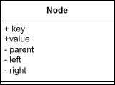

<style>
    section { justify-content: start; }
</style>

# Binary Search Tree

---

## Repetitionsaufgabe

Zeichnen Sie aus der untenstehenden Zahlenfolge einen binären Suchbaum.

```txt
45, 50, 32, 66, 40, 42, 38, 20, 46, 60, 73
```

---

## Musterlösung


---

## Entfernen von Knoten

1. Entfernen des Knotens mit dem Schlüssel 20
2. Entfernen des Knotens mit dem Schlüssel 32
   
   Aufbauend auf der Lösung der Teilaufgabe 1
3. Entfernen des Knotens mit dem Schlüssel 45
   
   Aufbauend auf der Lösung der Teilaufgabe 2

---

## Musterlösung 1


---

## Musterlösung 2


---

## Musterlösung 3a


## Musterlösung 3b


---

## Binary Search Tree in Python

### Knoten



---

## Binary Search Tree in Python

### Binary Search Tree


---

## Binary Search Tree in Python

### Implementation (soweit entwickelt)

[Musterlösung (stand am 21. Mai 24)](https://colab.research.google.com/github/I-gW-23-27/Skript/blob/main/docs/240521/unterlagen/240521_1gW_bst.ipynb)