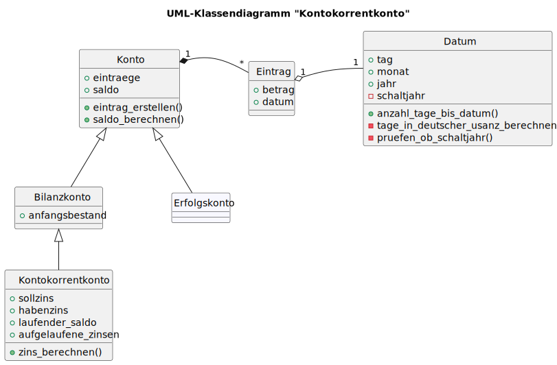

# Der binäre Suchbaum in Python

Hier wird eine Implementation binärer Suchbäume in Python vorgestellt.
Dazu wird auf die Möglichkeiten der objektorientierten Programmierung in
Python abgestellt.

## UML-Klassendiagramm eins binären Suchbaums

Alle Bäume, nicht nur Binärbäume, bestehen aus Knoten und Kanten. So
können binäre Suchbäume aus den zwei Klassen Knoten und Baum modelliert
werden. Die auf dieser Idee basierende Modellierung wird in
untenstehendem Diagramm dargestellt.



## Implementation der Klasse `Node`

Da die Klasse `Node` bis auf den Konstruktor über keine Methoden
verfügt, ist deren Implementation einfach.

```pyhton
class Node:
    def __init__(self, key,
                 value=None, parent=None, left=None, right=None):
        self.key    = key
        self.value  = value
        self.parent = parent
        self.left   = left
        self.right  = right
```

Es ist lediglich daran zu denken, dass für die Attribute `value`,
`parent`, `left` und `right` der Vorgabewert `None` zu setzen ist.

## Implementation der Klasse `BST`

In der Klasse `BST` sind neben dem Attribut `root` auch alle Methoden zu
implementieren. Dies wird im folgenden Schritt für Schritt aufgezeigt.

### Implementierung des Konstruktors

Der Konstruktor soll es ermöglichen, einen leeren Baum zu Instantiren
oder eine Instanz mit einem Wurzelknoten anzulegen.

```python
class BST:
    def __init__(self, key = None, value = None):
        if key == None:
            self.root = None
        else:
            self.root = Node(key, value)
```

### Implementierung der Methode `insert()`

Bevor in einem binären Suchbaum gesucht werden kann, müssen in der
Datenstruktur Daten abgelegt werden können. Aus diesem Grund wird als
erstes die Methode `insert()` implementiert.

Für die Implementation der Methode `insert()` ist an die folgenden Fälle
zu denken:

1. Der Baum ist leer und der Knoten ist als Wurzelknoten einzufügen.
2. Der Knoten ist kleiner als der Vergleichsknoten und der
   Vergleichsknoten hat bereits ein linkes Kind.
3. Der Knoten ist kleiner als der Vergleichsknoten.
4. Der Knoten ist grösser als der Vergleichsknoten und der
   Vergleichsknoten hat bereits ein rechtes Kind.
5. Der Knoten ist grösser als der Vergleichsknoten.

Als Flow Chart dargestellt sieht die Methode `insert()` folgendermassen
aus:


Die vorliegende Grafik zeigt eine rekursive Implementation.
Grundsätzlich wäre auch ein iteratives Vorgehen möglich, ein solches ist
aber deutlich aufwändiger.

Die rekursive Implementierung der Methode `insert()` zeigt das folgende
Listing:

```Python
def insert(self, key, value = None):
        node = Node(key)

        if self.root is None:
            self.root = node
            return
        
        ref = self.root      

        if node.key <= ref.key and ref.left is None:
            ref.left = node
            node.parent = ref
            return
      
        elif node.key <= ref.key:
            while ref.left:
                ref = ref.left
            ref.left = node
            node.parent = ref
            return
        
        elif node.key > ref.key and ref.right is None:
            ref.right = node
            node.parent = ref
            return
        
        else:
            while ref.right:
                ref = ref.right
            ref.right = node
            node.parent = ref.right
            return
```

### Implementierung der Methode `search()`

Die Methode `search()` sucht Anhand eines gegebenen Schlüssels den
entsprechenden Knoten im Baum. Wird der Knoten gefunden, wird er
zurückgegeben. Wird der Knoten nicht gefunden, ist der Rückgabewert
`None`. Die Vorgehensweise wird in untenstehender Flow Chart
dargestellt.


```Python
def search(self, key, ref=None):

        if self.root is None:
            return
        
        if ref is None:
            ref = self.root

        if key == ref.key:
            return ref
        
        elif key < ref.key and ref.left:
            return self.search(key, ref.left)
        
        elif key < ref.key:
            return
        
        elif key > ref.key and ref.right:
            return self.search(key, ref.right)
        
        else:
            return
```

### Implementation der Methode `delete()`

Um einen Knoten löschen zu können, muss er zuerst anhand des Schlüssels
gefunden werden. Dann können drei Fälle unterschieden werden:

1. Der Knoten ist ein Blatt;
2. der Knoten hat ein Kind oder
3. der Knoten hat zwei Kinder.

Auch diese Methode soll zuerst mit Hilfe eines Flussdiagramms
dargestellt werden.


Die Umsetzung findet sich in untenstehendem Listing:

```Python
def delete(self, key):
        to_delete = self.search(key)
        if to_delete is None:
            return  # Schlüssel nicht gefunden

        parent = to_delete.parent

        ## Node is leaf
        if to_delete.left is None and to_delete.right is None:
            if to_delete == self.root:
                self.root = None
            elif key < parent.key:
                parent.left = None
            else:
                parent.right = None
            return
        
        ## Node has one child
        if to_delete.left is None:
            if to_delete == self.root:
                self.root = to_delete.right
                self.root.parent = None
            else:
                if key < parent.key:
                    parent.left = to_delete.right
                else:
                    parent.right = to_delete.right
                to_delete.right.parent = parent
            return
        
        elif to_delete.right is None:
            if to_delete == self.root:
                self.root = to_delete.left
                self.root.parent = None
            else:
                if key < parent.key:
                    parent.left = to_delete.left
                else:
                    parent.right = to_delete.left
                to_delete.left.parent = parent
            return
        
        ## Node has two children
        else:
            successor = self.get_min(to_delete.right)
            to_delete.key = successor.key
            to_delete.value = successor.value
            if successor.key < successor.parent.key:
                successor.parent.left = None
            else:
                successor.parent.right = None
            
    def get_min(self, node):
        current = node
        while current.left is not None:
            current = current.left
        return current
```