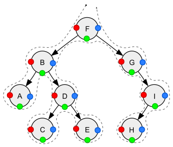

# Tree Traversal

Beim Tree Traversal geht es darum jeden Knoten in einem Baum zu
Besuchen. Mit Besuchen ist gemeint, dass mit dem Knoten etwas geschieht
\- zum Beispiel die Ausgabe der Knoten oder das Update der in
den Knoten abgelegten Files.

Um alle Knoten zu besuchen gibt es verschiedene Vorgehensweisen.
Grundsätzlich wird unterschieden zwischen Tiefen- und Breitensuche.

## Tiefensuche

In der Tiefensuche wird im Baum soweit nach unten gegangen, bis der
unterste Knoten eines Astes erreicht wird. Erst danach werden die Knoten
rechts besuch. Die unstenstehende Animation soll dies veranschaulichen.

<figure>
    
    <figcaption>Quelle: https://en.wikipedia.org/wiki/Depth-first_search</figcaption>
</figure>

Um eine Tiefensuche durchzuführen sind folgende Operationen auf jeden
besuchten Knoten anzuwenden:

1. Wenn der aktuelle Knoten leer ist `return`.
2. Die folgenden drei Operationen sind auf jeden Knoten anzuwenden. Die
   Reihenfolge der Operationen ist von der Variante der Tiefensuche
   abhängig (vgl. Unten).
   * N: Den aktuellen Knoten besuchen.
   * L: Rekursiv den linken Teilbaum des aktuellen Knotens durchlaufen.
   * R: Rekursiv den rechten Teilbaum des aktuellen Knotens durchlaufen.

Die Reihenfolge der besuchten Knoten wird als Sequenzialisierung des
Baums bezeichnet. Dabei gibt es drei Varianten der Sequenzialisierung:

* Pre-order (NLR)
  1. Den aktuellen Knoten besuchen.
  2. Rekursiv den linken Teilbaum des aktuellen Knotens durchlaufen.
  3. Rekursiv den rechten Teilbaum des aktuellen Knotens durchlaufen.
* Post-order (LRN)
  1. Rekursiv den linken Teilbaum des aktuellen Knotens durchlaufen.
  2. Rekursiv den rechten Teilbaum des aktuellen Knotens durchlaufen.
  3. Den aktuellen Knoten besuchen.
* In-order (LNR)
  1. Rekursiv den linken Teilbaum des aktuellen Knotens durchlaufen.
  2. Den aktuellen Knoten besuchen.
  3. Rekursiv den rechten Teilbaum des aktuellen Knotens durchlaufen.

Die untenstehende Grafik bildet die drei Varianten ab:

<figure>
    
    <figcaption>
        
Tiefensuche in einem Binärbaum (gestrichelter Pfad):
 
        
Pre-order (der Knoten wird beim roten Punkt besucht):    
           F, B, A, D, C, E, G, I, H;
   
        
In-order (der Knoten wird beim grünen Punkt besucht):    
           A, B, C, D, E, F, G, H, I;
   
        
Post-order (der Knoten wird beim blauen Punkt besucht):  
           A, C, E, D, B, H, I, G, F.
 
        
Quelle: https://en.wikipedia.org/wiki/Tree_traversal#Depth-first_search
 
    </figcaption>
</figure>

## Breitensuche

In der Breitensuche werden die Knoten des Baumes Ebene für Ebene
besucht.

<figure>
    
    <figcaption>
        Quelle: https://de.wikipedia.org/wiki/Breitensuche
    </figcaption>
    
</figure>

## Anwendungen

Den folgenden Ausführungen liegt der untenstehende Ausdrucksbaum zu
Grunde:

<figure>
    
    <figcaption>
    
Ein abstrakter Strukturbaum, der den arithmetischen Ausdruck A * (B - C) + (D + E) darstellt.

    
Quelle: https://en.wikipedia.org/wiki/Tree_traversal#Applications

    </figcaption>
</figure>

Pre-order Traversierung kann verwendet werden, um einen Präfix-Ausdruck
(polnische Notation) aus Ausdrucksbäumen zu bilden: Traversieren Sie den
Ausdrucksbaum in pre-order Reihenfolge. Wenn man zum Beispiel den dargestellten
arithmetischen Ausdruck in vorgeordneter Reihenfolge durchläuft, erhält
man $+ * A - B C + D E$. In der Präfix-Notation sind keine Klammern
erforderlich, solange jeder Operator eine feste Anzahl von Operanden
hat.

Die Traversierung des Ausdrucksbaums in Post-order Reihenfolge ergibt
eine  Postfix-Darstellung (umgekehrte polnische Notation). Für den
gegebenen arithmetischen Ausdruck ergibt sich die Notation $A B C - * D
E + +$. Diese Form kann leicht in Maschinencode
umgewandelt werden.

Die Traversierung in in-order Reihenfolge wird sehr häufig bei binären
Suchbäumen verwendet. Die in-order Traversierung eines binären
Suchbaumes ergibt eine aufsteigende Sortierung der im binären Suchbaum
abgelegten Schlüssel.[^1]

[^1]: https://en.wikipedia.org/wiki/Tree_traversal, besucht am 9. Juni 24