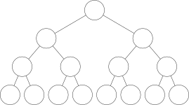
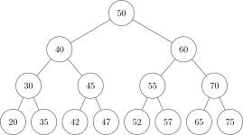
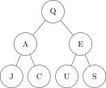
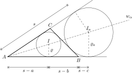

<a target="_blank" href="https://colab.research.google.com/github/I-gW-23-27/Skript/blob/main/docs/240618/repetitionen.ipynb">
  
</a>

# Repetitionen für die Prüfung vom 25. Juni 24

In diesem Dokument werden Repetitionsaufgaben für die kommende Prüfung
zur Verfügung gestellt.

## Binary Search Tree

1. Sortieren Sie die Zahlenfolge 42, 55, 38, 45, 24, 40, 60, 59, 70 in
   einen binären Suchbaum ein. Als Hilfsmittel verwenden Sie
   untenstehendes Raster.

   

2. Gegeben sei der folgende binäre Suchbaum:
   
   

   a) Zeichnen Sie den binären Suchbaum, nachdem Sie den Knoten mit dem
   Schlüssel 57 gelöscht haben.

   

   b) Zeichnen Sie den binären Suchbaum, nachdem Sie den Knoten mit dem
   Schlüssel 40 gelöscht haben.

   

## Tree Travesal

1. Was für ein Wort resultiert aus untenstehendem Baum bei einer
   in-order Traversierung?

   

2. Füllen Sie die folgende Rechnung so in untenstehenden Baum ein, dass
   bei einer post-order Traversierung die Rechenoperationen in korrekter
   Reihenfolge ausgeführt werden.

   $$
   2+\frac{8-2}{1+2}
   $$

   

## Funktionen in Python

Ausgehend von der folgenden Zeichnung Implementieren Sie im folgenden geometrischen Formeln als
Python-Funktionen.



| Variabel | Beschreibung |
| :--- | :--- |
| $s$ | halber Umfang ($(a+b+c)/2$) |
| $I$ | Mittelpunkt des Inkreises |
| $\varrho$ | Radius des Inkreises |
| $I_a$ | Mittelpunkt des Ankreises |
| $\varrho_a$ | Radius des Ankreises |
| $w_{\alpha}$ | Winkelhalbierende des Winkels $\alpha$ |
| $r$ | Radius des Umkreises (in der Skizze nicht dargestellt) |


1. Flächeninhalt (Heron):  
   $A = \sqrt{s(s-a)(s-b)(s-c)}$

2. Umkreisradius:  
   $r = \frac{abc}{4A}$

3. Inkreisradius:  
   $\varrho = \frac{A}{s}$

4. Ankreisradius:  
   $\varrho_a = \frac{A}{s-a}$

5. Berechnung der Höhen:  
   * $h_a = \frac{2A}{a}$
   * $h_b = \frac{2A}{b}$
   * $h_c = \frac{2A}{c}$


```python
# Flächeninhalt (Heron): 
```


```python
# Umkreisradius:
```


```python
# Inkreisradius:
```


```python
# Ankreisradius:
```


```python
# Berechnung der Höhen:
```
