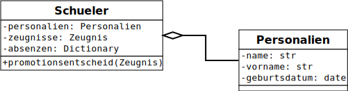

# Objekt Orientierte Programmierung

Im bisherigen Unterricht wurden verschiedene Datenstrukturen vorgestellt sowie
einzelne Funktionen implementiert. Im folgenden wird es darum gehen, eigene
Datenstrukturen anzulegen und diese mit spezifischen Funktionen - man spricht in
diesem Zusammenhang von Methoden - zu versehen. Um Datenstrukturen und Methoden
zu kombinieren werden Klassen angelegt.

## Modellierung von Klassen

Klassen werden programmiert, um Objekte aus dem echten Leben abzubilden. Als
Beispiel soll hier eine Klasse zur Modellierung von Schülerinnen und Schülern
für eine Schule skizziert werden.  
Die für die Modellierung für die Schule wichtigen Eigenschaften sind die
erforderlichen Datenstrukturen und die Kontrolle der Bestehensvoraussetzungen
die Methoden.

Wichtige Eigenschaften neben den Personalien sind im Zusammenhang mit der
Schule die Noten und Absenzen. Die Bestehensvoraussetzungen werden mit einer
Methode Promotionsentscheid kontrolliert. Die Personalien können in einer
eigenen Klasse modelliert werden.

Wenn Klassen modelliert werden, können diese in der Entwurfsphase als
UML-Klassendiagramm graphisch dargestellt werden. Das obige Beispiel sieht dann
wie in der folgenden Grafik dargestellt aus.



## Klassen in Python

Um eine Klasse in Python zu implementieren, kann ein eigenes Python File
angelegt werden (.py). Ein solches File hat für das Beispiel Personalien den
folgenden Inhalt:

```Python
# personalien.py

import datetime

class Personalien:
    def __init__(self, name : str, vorname : str, geburtsdatum : datetime):
        self.name = name
        self.vorname = vorname
        self.geburtsdatum = geburtsdatum
```
