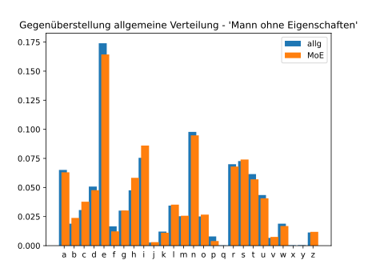

# Polyalphabetische Chiffren

## Schwächen monoalphabetischer Chiffren

Bereits im 9. Jahrhundert wurde im islamischen Raum die grosse Schwachstelle
monoalphabetischer Chiffren (Caesar-Chiffre) erkannt. Die Verteilung der
Buchstaben folgt in jeder Sprache einem spezifischen aber konstanten Muster. Für
die deutsche Sprache ist die Verteilung der folgenden Tabelle zu entnehmen.

| Buchstabe | relative Häufigkeit | Buchstabe | relative Häufigkeit | Buchstabe | relative Häufigkeit |
| --- | --- | --- | --- | --- | --- | 
| a | 0.0651 | l | 0.0344 | w | 0.0189 |
| b | 0.0189 | m | 0.0253 | x | 0.0003 |
| c | 0.0306 | n | 0.0978 | y | 0.0004 |
| d | 0.0508 | o | 0.0251 | z | 0.0113 |
| e | 0.1740 | p | 0.0079 | |
| f | 0.0166 | q | 0.0002 | |
| g | 0.0301 | r | 0.0700 | |
| h | 0.0476 | s | 0.0727 | |
| i | 0.0755 | t | 0.0615 | |
| j | 0.0027 | u | 0.0435 | |
| k | 0.0121 | v | 0.0067 | |

Um zu zeigen, dass dies sich mit (längeren) Texten deckt, wurde ein Kapitel aus
dem Roman 'Der Mann ohne Eigenschaften' von Robert Musil ausgewertet. Die sich
aus dieser Auswertung ergebende Verteilung wird in der folgenden Grafik der
Verteilung aus der Tabelle gegenübergestellt.

Die Grafik zeigt, dass bei einer Textlänge von 13'343 Buchstaben die Verteilung
in einem literarischen Text nahezu identisch ist, mit der allgemeinen
Häufigkeitsverteilung in der deutschen Sprache.

Die nächste Grafik zeigt, was mit der Verteilung der Buchstaben geschieht, wenn
der gleiche Text mit einer Caesar-Chiffre verschlüsselt worden ist.

Es ist deutlich zu erkennen, dass die Verteilung dem gleichen Muster folgt -
verschoben um fünf Positionen. Diese Auswertung ermöglicht die Entschlüsselung
des Textes, ohne alle möglichen Schlüsselalphabete durchzuprobieren.